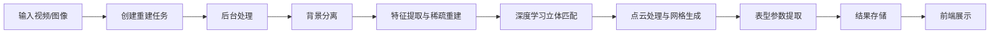
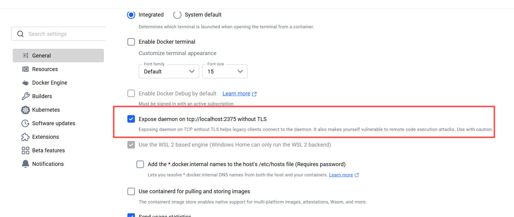
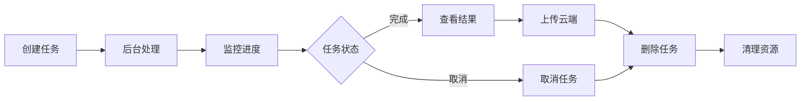

# 三维重建 API 使用指南

基于COLMAP+MVSNet的高精度3D植物重建与表型参数提取系统，集成BiRefNet背景分离、深度学习立体匹配和Open3D点云处理技术，专注于农业植物的三维形态分析与数字化表型测量。

## 功能说明

CropPheno（作物表型）模块用于处理植物的三维重建任务，包括从视频或图像生成3D模型，并提取相关表型参数。

### 1. 三维重建流程
- 输入可以是单个视频文件或包含多个图像的目录
- 系统使用BiRefNet进行背景分离
- 采用COLMAP进行特征提取和稀疏重建
- 利用MVSNet进行深度学习立体匹配生成密集点云
- 使用Open3D进行点云处理和网格生成
- 提取植物表型参数（如高度、体积、叶面积等）

## 数据处理流程



----

## API 接口说明

路由文件：[vdcm.py](../routers/v1/vdcm.py)

### 任务管理接口

1. **创建重建任务** `POST /croppheno/jobs`
   - 创建一个新的三维重建任务
   - 参数：
     - `title`: 任务标题（可选, 系统自动生成）
     - `sample_number`: 样本编号（可选，系统自动生成）
     - `sample_batch_number`: 样本批次编号（可选，系统自动生成）
     - `no`: 任务唯一标识符（可选，系统自动生成）
     - `job_type`: 任务类型（VIDEO 或 IMAGE）
     - `src_path`: 源文件路径(这里没有上传的逻辑，文件放到 media/ 文件夹下)
     - `taken_at`: 拍摄时间（可选，系统自动获取视频/图片文件创建时间）
     - `frame_count`: 视频帧数（默认150，仅对视频有效）

2. **获取任务列表** `GET /croppheno/jobs`
   - 获取任务列表，支持分页和筛选
   - 参数：
     - `page`: 页码（默认1）
     - `limit`: 每页数量（默认1000）
     - `state`: 任务状态筛选
     - `title`: 任务标题模糊搜索

3. **更新任务进度** `PATCH /croppheno/jobs/{no}/progress`
   - 更新指定任务的进度百分比(此API供3dcm重建任务回调使用)
   - 参数：
     - `no`: 任务唯一标识符
     - `percent`: 进度百分比

4. **取消任务** `POST /croppheno/jobs/{no}/cancel`
   - 取消正在运行的任务（会移除正在运行的容器、删除生成的资源文件、删除记录）
   - 参数：
     - `no`: 任务唯一标识符

5. **删除任务** `DELETE /croppheno/jobs/{no}`
   - 删除任务及其相关文件
   - 参数：
     - `no`: 任务唯一标识符

### 报告上传接口

6. **上传报告** `POST /croppheno/jobs/{no}/upload`
   - 将完成的任务结果上传到云端(此API供企业把结果上传到云端存储使用，自行实现上传逻辑)
   - 需要提供认证信息作为请求头：
     - `token`: 认证令牌
     - `cid`: 客户端ID
     - `terminal-id`: 终端ID
     - `terminal-type`: 终端类型
   - 参数：
     - `no`: 任务唯一标识符

## Docker-out-of-Docker (DooD) 配置指南

在使用Docker容器运行三维重建任务时，系统采用Docker-out-of-Docker (DooD)模式，即容器内的应用需要调用宿主机的Docker守护进程来执行重建任务。为确保系统正常运行，需要进行以下配置：

### 工作目录配置

当使用 [docker-compose.yml](../docker-compose.yml) 启动服务时，容器内的Celery工作进程需要连接宿主机的Docker进程。因此需要特别注意以下配置：

1. **HOST_DIR环境变量**：
   - 该环境变量确保容器内任务能正确访问宿主机目录
   - 在[docker-compose.yml](../docker-compose.yml)中已配置为`${PWD}`，即当前工作目录
   - 所有输入文件（如视频、图像）必须放置在项目根目录下的`media/`文件夹中

2. **文件路径示例**：
   ```shell
   curl -X 'POST' \
     'http://localhost:7700/api/croppheno/jobs' \
     -H 'accept: application/json' \
     -H 'Content-Type: application/json' \
     -d '{
     "job_type": "IMAGE",
     "src_path": "media/extract"
   }'
   ```
   在上述示例中，`"src_path": "media/extract"`表示项目根目录下的`media/extract`目录。
3. **celery worker：** `worker-reconstruction`，相关日志请查看该容器
4. Linux下注意用户权限的问题，因为在删除任务时 `DELETE /croppheno/jobs/{no}` 会移除容器内生成文件，请保持用户一致。启动时添加 `UID=$(id -u) GID=$(id -g) docker-compose up -d`

---

### Docker TCP 端口配置

容器需要通过TCP连接访问宿主机的Docker守护进程，因此需要在宿主机上启用Docker TCP端口。

#### Linux 系统配置
以`#88~22.04.1-Ubuntu`为例（其他自行解决）：
1. 编辑文件：`sudo vi /lib/systemd/system/docker.service`
2. 找到ExecStart行，末尾添加以下配置: `-H tcp://0.0.0.0:2375`
3. 重启 Docker 服务：
   - `sudo systemctl daemon-reload`
   - `sudo systemctl restart docker`
4. 验证端口是否监听：`sudo netstat -tlnp | grep 2375`

#### Windows 系统配置

1. 打开Docker Desktop设置
2. 进入 " General " 选项卡
3. 勾选 " Expose daemon on tcp://localhost:2375 without TLS "
3. 点击 " Apply & Restart " 重启Docker服务

**参考配置界面：**



### 安全注意事项
- Docker TCP端口(2375) 默认没有配置密钥验证，生成环境可自行配置
- 确保`media/`目录具有适当的读写权限
- 确保防火墙规则阻止外部访问2375端口
- 容器内都关联了 nvidia 驱动，请确保宿主机上安装 [Nvidia Container Toolkit](https://docs.nvidia.com/datacenter/cloud-native/container-toolkit/latest/install-guide.html#with-apt-ubuntu-debian)
  - 测试: `docker run --rm --gpus all nvidia/cuda:11.8-base nvidia-smi`


## 使用流程

### 基本工作流程

1. **准备阶段**：准备好视频文件或图像目录
2. **创建任务**：调用创建任务接口 `POST /croppheno/jobs` 提供源文件路径等信息
3. **监控进度**：通过获取任务列表接口 `GET /croppheno/jobs` 监控任务状态和进度
4. **查看结果**：任务完成后，查看生成的3D模型和表型参数
5. **上传云端**：可选地将结果上传到云端存储

### 异步任务处理

三维重建是一个耗时操作，系统采用异步处理方式：

1. 创建任务后，系统立即返回任务信息
2. 后台开始执行重建任务
3. 客户端需要定期轮询任务状态，直到任务完成
4. 任务完成后可以查看结果并进行后续操作
