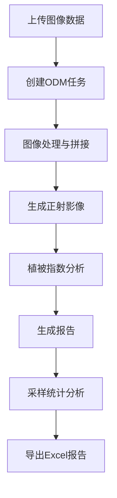

# 遥感影像 API 使用指南

基于 [WebOdm](https://github.com/OpenDroneMap/WebODM), 使用 GDAL 和 NumExpr 的高性能遥感数据处理引擎，专注于植被指数分析和农业监测。
支持NDVI、ExG 等自定义植被指数算法，采用块处理技术实现大图像高效处理

## 启动WebOdm
```bash
./webodm.sh start --port 800 --media-dir media/ --db-dir tmpdb/ --detached
```

----

## API 接口说明

路由文件：[orsdm.py](../routers/v1/orsdm.py)

### ODM 任务管理接口

1. **创建ODM任务** `POST /odm/create_odm_job`
   - 创建一个异步任务，用于COPY图片到WebOdm的media目录下，并发起 commit ODM任务
   - 参数：
     - `odm_project_id`: 项目ID
     - `odm_task_id`: 任务ID
     - `odm_job_name`: 任务名称
     - `odm_src_folder`: 源文件夹路径 (相对于 `MOUNT_USB_DIR` 的目录, 通常指向的是挂载的移动盘目录)
     - `odm_host`: ODM主机地址（可选， 默认获取环境变量 `ODM_HOST`）
     - `odm_job_type`: 任务类型 (如: multispectral)
     - `radiometric`: 辐射校正参数（可选）

2. **获取ODM任务列表** `GET /odm/get_odm_jobs`
   - 获取ODM任务列表，支持分页和筛选
   - 参数：
     - `page`: 页码（默认1）
     - `limit`: 每页数量（默认1000）
     - `only_running`: 是否只显示运行中的任务（默认True）

3. **取消ODM任务** `GET /odm/cancel_odm_job`
   - 取消一个正在运行的ODM任务
   - 参数：
     - `project_id`: 项目ID
     - `task_id`: 任务ID

4. **移除ODM任务** `GET /odm/remove_odm_job`
   - 移除一个已完成、失败或已取消的ODM任务
   - 参数：
     - `project_id`: 项目ID
     - `task_id`: 任务ID

### 报告生成与管理接口

5. **生成报告** `POST /odm/generate_report`
   - 为已完成的ODM任务生成报告
   - 参数：
     - `project_id`: 项目ID
     - `task_id`: 任务ID
     - `orthophoto_tif`: 正射影像文件路径

6. **保存报告** `PUT /odm/save_report/{project_id}/{task_id}`
   - 保存ODM报告到数据库
   - 参数：
     - `project_id`: 项目ID
     - `task_id`: 任务ID

7. **获取报告详情** `GET /odm/get_report_detail`
   - 获取指定ODM任务的报告详情
   - 参数：
     - `project_id`: 项目ID
     - `task_id`: 任务ID

8. **获取报告列表** `GET /odm/get_reports`
   - 获取报告列表，支持分页和筛选
   - 参数：
     - `page`: 页码（默认1）
     - `limit`: 每页数量（默认1000）
     - `only_running`: 是否只显示运行中的报告任务（默认True）

9. **上传报告** `POST /odm/upload_report`
   - 将报告上传到云端存储
   - 请求头：
     - `token`: 认证令牌
     - `cid`: 客户端ID
   - 参数：
     - `project_id`: 项目ID
     - `task_id`: 任务ID
     - `report_no`: 报告编号

10. **取消上传任务** `GET /odm/cancel_upload_task`
    - 取消正在进行的报告上传任务
    - 参数：
      - `project_id`: 项目ID
      - `task_id`: 任务ID

### 采样统计接口

路由文件：[sampling.py](../routers/v1/sampling.py)

11. **获取采样记录列表** `GET /odm/samplings`
    - 获取指定ODM任务的采样记录列表
    - 参数：
      - `project_id`: 项目ID
      - `task_id`: 任务ID

12. **获取采样记录详情** `GET /odm/samplings/{sampling_id}`
    - 获取指定采样记录的详细信息，包括统计信息
    - 参数：
      - `sampling_id`: 采样记录ID
      - `latest_only`: 是否只返回最新运行的数据（默认True）

13. **创建采样记录** `POST /odm/samplings`
    - 为指定ODM任务创建新的采样记录
    - 参数：
      - `project_id`: 项目ID
      - `task_id`: 任务ID
      - `title`: 采样记录标题（可选）

14. **获取或创建采样记录** `POST /odm/samplings/retrieve_or_create`
    - 获取指定ODM任务的最新采样记录，如果不存在则创建新记录
    - 参数：
      - `project_id`: 项目ID
      - `task_id`: 任务ID
      - `title`: 采样记录标题（可选）

15. **初始化采样统计** `POST /odm/samplings/{sampling_id}/statistics`
    - 启动采样统计计算的后台任务
    - 参数：
      - `sampling_id`: 采样记录ID
      - `data`: 样方数据列表，包含每个样方的坐标信息

16. **导出采样统计数据到Excel** `GET /odm/samplings/{sampling_id}/export_to_excel`
    - 将采样统计数据导出为Excel文件
    - 参数：
      - `sampling_id`: 采样记录ID
      - `filename`: 导出文件名（可选）
      - `stream`: 是否以流形式返回文件（默认False，返回文件路径）

17. **删除采样记录** `DELETE /odm/samplings/{sampling_id}`
    - 删除指定的采样记录（标记为已删除）
    - 参数：
      - `sampling_id`: 采样记录ID

18. **删除样方记录** `DELETE /odm/samplings/{sampling_id}/quadrat/{quadrat_id}`
    - 删除指定的样方记录（标记为已删除）
    - 参数：
      - `sampling_id`: 采样记录ID
      - `quadrat_id`: 样方记录ID

## 数据处理流程



## 功能说明

### ODM任务管理
- 支持创建、监控、取消和删除ODM处理任务
- 通过WebODM进行图像处理和拼接
- 支持多光谱图像处理

### 报告生成与管理
- 自动生成处理报告，包括正射影像和植被指数图
- 支持报告上传到云端存储
- 提供报告查询和管理功能

### 采样统计分析
- 支持在图像上定义采样区域（样方）
- 自动计算各样方的植被指数统计信息
- 支持将统计结果导出为Excel文件

### 数据导出
- 支持将采样统计数据导出为Excel格式
- 可选择返回文件流或保存到服务器并返回文件路径
- Excel文件包含详细的植被指数统计数据

## 使用流程

1. **准备阶段**：准备好需要处理的遥感图像数据
2. **创建任务**：调用`POST /odm/create_odm_job`创建ODM处理任务
3. **监控进度**：通过`GET /odm/get_odm_jobs`监控任务状态和进度
4. **生成报告**：任务完成后，调用相关接口生成和保存报告
5. **采样分析**：在图像上定义采样区域，进行统计分析
6. **导出数据**：将分析结果导出为Excel文件