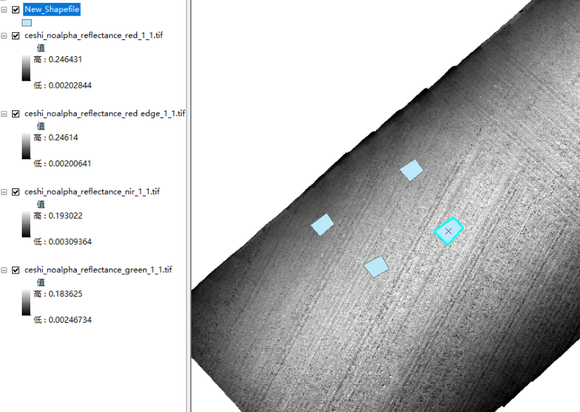
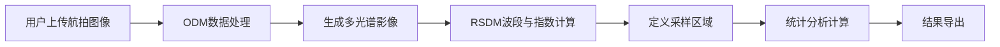

# 采样统计 API 使用指南

采样统计模块用于处理遥感影像中的样方数据，并将结果导出到 Excel 文件。

## 功能说明

### 1. 样方区域确定
- 在确定样方中心坐标点之后，使用 ArcMap 的"缓冲区"工具在中心点附近生成 1m*1m（或其他大小）的正方形样方区域
- 样方可通过编号进行区分

### 2. 指数统计
- 样方区域确定之后，利用 ArcMap 的"分区统计"工具对样方区域进行反射率提取和光谱指数计算
- 支持的光谱指数：
  * NDVI = (NIR - Red) / (NIR + Red)
  * GNDVI = (NIR - Green) / (NIR + Green)
  * NDRE = (NIR - RedEdge) / (NIR + RedEdge)

## 导出数据内容

1. 样方的坐标点（四个角坐标+中心点坐标）
2. 样方的反射率：样方内各个波段（Red、Green、Blue、RE、NIR）的最大值、最小值、平均值、标准差
3. 样方的光谱指数：NDVI、GNDVI、NDRE 的最大值、最小值、平均值、标准差

## Excel 模板

Excel 模板由 [sampling_data_exporter.py](../utils/sampling_data_exporter.py) 文件生成和处理。该文件负责：
- 创建 Excel 模板
- 将样方统计数据导出到 Excel 文件
- 格式化导出的 Excel 文件

## 数据扭转

采样功能的素材来源于 ODM（OpenDroneMap）模块，整个数据处理流程如下：

1. **ODM处理阶段**：用户上传航拍图像至ODM系统进行处理
2. **多光谱影像生成**：ODM处理完成后发起RSDM任务，生成多光谱影像文件（包含各波、NDVI、GNDVI、NDRE等植被指数）
3. **采样区域定义**：用户在多光谱影像上定义采样区域（样方）
4. **统计分析执行**：系统基于定义的样方区域，从多光谱影像中提取数据并计算各项统计指标
5. **结果导出**：将统计结果整理为结构化数据，支持Excel格式导出

## API 接口说明

路由文件：[sampling.py](../routers/v1/sampling.py)

### 方案一：一个 ODM 任务（project_id, task_id）下对应多个样方记录

1. **获取采样记录** `GET /odm/samplings` - 一个 ODM 任务下可以有多个样方记录
2. **创建采样记录** `POST /odm/samplings`
3. **发起样方统计计算** `POST /odm/samplings/{sampling_id}/statistics` - 异步任务，需要轮询任务状态
4. **查询样方统计结果** `GET /odm/samplings/{sampling_id}?latest_only=bool`
5. **导出采样记录到 Excel** `GET /odm/samplings/{sampling_id}/export_to_excel`
6. **删除采样记录** `DELETE /odm/samplings/{sampling_id}`

### 方案二：一个 ODM 任务（project_id, task_id）对应一个样方记录

1. **创建或者获取样方记录** `POST /odm/samplings/retrieve_or_create` - 系统会根据 project_id 和 task_id 判断是否已经创建过样方记录，如果没有则创建，如果有则返回已存在的样方记录
2. 剩下的步骤同方案一

## 使用流程

### 基本工作流程

1. **准备阶段**：确保 ODM 任务已完成并生成了多光谱影像
2. **创建采样记录**：使用对应接口创建采样记录
3. **定义样方**：提供样方的坐标信息
4. **执行统计**：发起统计计算任务
5. **查看结果**：查询统计结果
6. **导出数据**：将结果导出为 Excel 文件

### 异步任务处理

样方统计计算是一个耗时操作，系统采用异步处理方式：

1. 发起统计计算后，系统立即返回采样记录信息
2. 后台任务开始执行统计计算
3. 客户端需要定期轮询任务状态，直到任务完成
4. 任务完成后可以查询统计结果并导出

## 注意事项

1. **数据依赖**：采样统计功能依赖于 ODM 任务生成的多光谱影像文件
2. **任务状态**：请及时关注异步任务的执行状态
3. **文件导出**：导出的 Excel 文件包含完整的样方统计信息
4. **删除操作**：删除采样记录为软删除，数据仍保存在数据库中